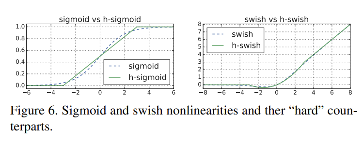

# bfmd: backbones for mobile device


### 安装
```python
pip install bfmd
```

## Table of Contents
### [MobileNets系列](#MobileNet)

### [ShuffleNet系列](#ShuffleNet)

### [Inception系列](#inception)

### [EfficientNet系列](#efficientnet)

### [Blazeface的feature提取器](#blazenet)

### MobileNets系列
本小节主要汇总了基于Google 提出来的适用于手机端的网络架构MobileNets的系列改进，针对每个网络架构，将主要总结每个不同模型的核心创新点，模型结构图以及代码实现.
   - [MobileNetV1](#mbv1)
   - [MobileNetV2](#mbv2)
   - [MobileNetV3](#mbv3)
   - [MobileNeXt](#mbnext)

<a name="mbv1"></a>  

#### MobileNetv1 

- [MobileNets: Efficient Convolutional Neural Networks for Mobile Vision Applications](https://arxiv.org/abs/1704.04861)**CVPR2017**
MobileNetv1模型是Google针对移动端设备提出的一种轻量级的卷积神经网络，其使用的核心思想便是depthwise separable convolution（深度可分离卷积）。具体结构如下所示：


#### Code
```python
class DepthSeperabelConv2d(nn.Module):

    def __init__(self, input_channels, output_channels, kernel_size, **kwargs):
        super().__init__()
        self.depthwise = nn.Sequential(
            nn.Conv2d(
                input_channels,
                input_channels,
                kernel_size,
                groups=input_channels,
                **kwargs),
            nn.BatchNorm2d(input_channels),
            nn.ReLU(inplace=True)
        )

        self.pointwise = nn.Sequential(
            nn.Conv2d(input_channels, output_channels, 1),
            nn.BatchNorm2d(output_channels),
            nn.ReLU(inplace=True)
        )

    def forward(self, x):
        x = self.depthwise(x)
        x = self.pointwise(x)

        return x
```
<a name="mbv2"></a>  

#### MobileNetv2
- [MobileNetV2: Inverted Residuals and Linear Bottlenecks](https://arxiv.org/abs/1801.04381)**CVPR2018**

mobilenetv2 使用残差结构，首先进行Expansion操作然后再进行Projection操作，最终构建一个逆残差网络模块（即Inverted residual block）。

- LinearBottlenecks显著减少推理期间所需的内存占用。
- LinearBottlenecks具有抽取线性信息的能力，未被抽取的非线性信息由shortcut传递。
- 使用 RELU6（最高输出为 6）激活函数，使得模型在低精度计算下具有更强的鲁棒性。


#### Code
```python
class LinearBottleNeck(nn.Module):

    def __init__(self, in_channels, out_channels, stride, t=6, class_num=100):
        super().__init__()

        self.residual = nn.Sequential(
            nn.Conv2d(in_channels, in_channels * t, 1),
            nn.BatchNorm2d(in_channels * t),
            nn.ReLU6(inplace=True),

            nn.Conv2d(in_channels * t, in_channels * t, 3, stride=stride, padding=1, groups=in_channels * t),
            nn.BatchNorm2d(in_channels * t),
            nn.ReLU6(inplace=True),

            nn.Conv2d(in_channels * t, out_channels, 1),
            nn.BatchNorm2d(out_channels)
        )

        self.stride = stride
        self.in_channels = in_channels
        self.out_channels = out_channels

    def forward(self, x):

        residual = self.residual(x)

        if self.stride == 1 and self.in_channels == self.out_channels:
            residual += x

        return residual
```

<a name="mbv3"></a>  
#### MobileNetV3 

- [Searching for MobileNetV3](https://arxiv.org/abs/1905.02244) **ICCV2019**

核心改进点：
- 网络的架构基于NAS实现的MnasNet（效果比MobileNetV2好）  

- 论文推出两个版本：Large 和 Small，分别适用于不同的场景;

- 继承了MobileNetV1的深度可分离卷积  

- 继承了MobileNetV2的具有线性瓶颈的倒残差结构

- 引入基于squeeze and excitation结构的轻量级注意力模型(SE)  

- ```python
  class Squeeze_excite(nn.Module):
      def __init__(self, num_channels, r=4):
          """
          Squeeze-and-Excitation block
            Args:
              num_channels (int): number of channels in the input tensor
              r (int): num_channels are divided by r in the first conv block
          """
          super(Squeeze_excite, self).__init__()
  
          #instead of fully connected layers 1x1 convolutions are used, which has exactly the same effect as the input tensor is 1x1 after pooling
          #batch normalization is not used here as it's absent in the paper
          self.conv_0 = nn.Sequential(
              nn.AdaptiveAvgPool2d(1),
              nn.Conv2d(num_channels, num_channels//r, kernel_size=1),
              nn.ReLU(inplace=True)
          )
  
          self.conv_1 = nn.Sequential(
              nn.Conv2d(num_channels//r, num_channels, kernel_size=1),
              Hsigmoid()
          )
  
      def forward(self, input):
          out = self.conv_0(input)
          out = self.conv_1(out)
          out = out * input
          return 
  ```

  

- 使用了一种新的激活函数h-swish(x)  

  

  ```python
  class Hsigmoid(nn.Module):
      """
      Hard sigmoid function
      """
      def __init__(self, inplace: bool = True):
          super(Hsigmoid, self).__init__()
          self.inplace = inplace
  
      def forward(self, input):
          return F.relu6(input + 3.0, inplace=self.inplace) * (1.0/6.0)
  
  class Hswish(nn.Module):
      """
      Hard swish function
      """
      def __init__(self, inplace: bool = True):
          super(Hswish, self).__init__()
          self.inplace = inplace
  
      def forward(self, input):
          return F.relu6(input+3.0, inplace=self.inplace) * (1.0/6.0) * input
  ```

- 网络结构搜索中，结合两种技术：资源受限的NAS（platform-aware NAS）与NetAdapt 算法获得卷积核和通道的最佳数量

- 修改了MobileNetV2网络后端输出head部分;

- 基于mobilenetv3的分割网络优于基于mobilenetv2的分割网络，代码将在如下仓库公开


<a name="mbnext"></a>  

#### MobileNeXt 网络模块

- [Rethinking Bottleneck Structure for Efficient Mobile Network Design](https://arxiv.org/abs/2007.02269)**CVPR2020**

针对MobileNetV2的核心模块逆残差模块存在的问题进行了深度分析，提出了一种新颖的SandGlass模块，它可以轻易的嵌入到现有网络架构中并提升模型性能。

- Sandglass Block可以保证更多的信息从bottom层传递给top层，进而有助于梯度回传
- 执行了两次深度卷积以编码更多的空间信息。


#### Code
```python
class SGBlock(nn.Module):
    def __init__(self, inp, oup, stride, expand_ratio, keep_3x3=False):
        super(SGBlock, self).__init__()
        assert stride in [1, 2]

        hidden_dim = inp // expand_ratio
        if hidden_dim < oup / 6.:
            hidden_dim = math.ceil(oup / 6.)
            hidden_dim = _make_divisible(hidden_dim, 16)# + 16

        #self.relu = nn.ReLU6(inplace=True)
        self.identity = False
        self.identity_div = 1
        self.expand_ratio = expand_ratio
        if expand_ratio == 2:
            self.conv = nn.Sequential(
                # dw
                nn.Conv2d(inp, inp, 3, 1, 1, groups=inp, bias=False),
                nn.BatchNorm2d(inp),
                nn.ReLU6(inplace=True),
                # pw-linear
                nn.Conv2d(inp, hidden_dim, 1, 1, 0, bias=False),
                nn.BatchNorm2d(hidden_dim),
                # pw-linear
                nn.Conv2d(hidden_dim, oup, 1, 1, 0, bias=False),
                nn.BatchNorm2d(oup),
                nn.ReLU6(inplace=True),
                # dw
                nn.Conv2d(oup, oup, 3, stride, 1, groups=oup, bias=False),
                nn.BatchNorm2d(oup),
            )
        elif inp != oup and stride == 1 and keep_3x3 == False:
            self.conv = nn.Sequential(
                # pw-linear
                nn.Conv2d(inp, hidden_dim, 1, 1, 0, bias=False),
                nn.BatchNorm2d(hidden_dim),
                # pw-linear
                nn.Conv2d(hidden_dim, oup, 1, 1, 0, bias=False),
                nn.BatchNorm2d(oup),
                nn.ReLU6(inplace=True),
            )
        elif inp != oup and stride == 2 and keep_3x3==False:
            self.conv = nn.Sequential(
                # pw-linear
                nn.Conv2d(inp, hidden_dim, 1, 1, 0, bias=False),
                nn.BatchNorm2d(hidden_dim),
                # pw-linear
                nn.Conv2d(hidden_dim, oup, 1, 1, 0, bias=False),
                nn.BatchNorm2d(oup),
                nn.ReLU6(inplace=True),
                # dw
                nn.Conv2d(oup, oup, 3, stride, 1, groups=oup, bias=False),
                nn.BatchNorm2d(oup),
            )
        else:
            if keep_3x3 == False:
                self.identity = True
            self.conv = nn.Sequential(
                # dw
                nn.Conv2d(inp, inp, 3, 1, 1, groups=inp, bias=False),
                nn.BatchNorm2d(inp),
                nn.ReLU6(inplace=True),
                # pw
                nn.Conv2d(inp, hidden_dim, 1, 1, 0, bias=False),
                nn.BatchNorm2d(hidden_dim),
                #nn.ReLU6(inplace=True),
                # pw
                nn.Conv2d(hidden_dim, oup, 1, 1, 0, bias=False),
                nn.BatchNorm2d(oup),
                nn.ReLU6(inplace=True),
                # dw
                nn.Conv2d(oup, oup, 3, 1, 1, groups=oup, bias=False),
                nn.BatchNorm2d(oup),
            )

    def forward(self, x):
        out = self.conv(x)

        if self.identity:
            return out + x
        else:
            return out
```

<a name="ShuffleNet"></a>

#### ShuffleNet
<a name="shffv1"></a>  

#### ShuffleNetv1 网络模块

- [ShuffleNet: An Extremely Efficient Convolutional Neural Network for Mobile Devices](https://arxiv.org/abs/1707.01083)**CVPR2017**
- ShuffleNetv1采用了两个新的操作，pointwise group convolution和channel shuffle，以大大降低计算成本，同时保持
  准确性


```python
class PointwiseConv2d(nn.Module):
    def __init__(self, input_channels, output_channels, **kwargs):
        super().__init__()
        self.pointwise = nn.Sequential(
            nn.Conv2d(input_channels, output_channels, 1, **kwargs),
            nn.BatchNorm2d(output_channels)
        )

    def forward(self, x):
        return self.pointwise(x)
```

```python
class ChannelShuffle(nn.Module):

    def __init__(self, groups):
        super().__init__()
        self.groups = groups

    def forward(self, x):
        batchsize, channels, height, width = x.data.size()
        channels_per_group = int(channels / self.groups)

        #"""suppose a convolutional layer with g groups whose output has
        #g x n channels; we first reshape the output channel dimension
        #into (g, n)"""
        x = x.view(batchsize, self.groups, channels_per_group, height, width)

        #"""transposing and then flattening it back as the input of next layer."""
        x = x.transpose(1, 2).contiguous()
        x = x.view(batchsize, -1, height, width)

        return x
```


#### Code
```python
class ShuffleNetUnit(nn.Module):

    def __init__(self, input_channels, output_channels, stage, stride, groups):
        super().__init__()

        #"""Similar to [9], we set the number of bottleneck channels to 1/4
        #of the output channels for each ShuffleNet unit."""
        self.bottlneck = nn.Sequential(
            PointwiseConv2d(
                input_channels,
                int(output_channels / 4),
                groups=groups
            ),
            nn.ReLU(inplace=True)
        )

        #"""Note that for Stage 2, we do not apply group convolution on the first pointwise
        #layer because the number of input channels is relatively small."""
        if stage == 2:
            self.bottlneck = nn.Sequential(
                PointwiseConv2d(
                    input_channels,
                    int(output_channels / 4),
                    groups=groups
                ),
                nn.ReLU(inplace=True)
            )

        self.channel_shuffle = ChannelShuffle(groups)

        self.depthwise = DepthwiseConv2d(
            int(output_channels / 4),
            int(output_channels / 4),
            3,
            groups=int(output_channels / 4),
            stride=stride,
            padding=1
        )

        self.expand = PointwiseConv2d(
            int(output_channels / 4),
            output_channels,
            groups=groups
        )

        self.relu = nn.ReLU(inplace=True)
        self.fusion = self._add
        self.shortcut = nn.Sequential()

        #"""As for the case where ShuffleNet is applied with stride,
        #we simply make two modifications (see Fig 2 (c)):
        #(i) add a 3 × 3 average pooling on the shortcut path;
        #(ii) replace the element-wise addition with channel concatenation,
        #which makes it easy to enlarge channel dimension with little extra
        #computation cost.
        if stride != 1 or input_channels != output_channels:
            self.shortcut = nn.AvgPool2d(3, stride=2, padding=1)

            self.expand = PointwiseConv2d(
                int(output_channels / 4),
                output_channels - input_channels,
                groups=groups
            )

            self.fusion = self._cat

    def _add(self, x, y):
        return torch.add(x, y)

    def _cat(self, x, y):
        return torch.cat([x, y], dim=1)

    def forward(self, x):
        shortcut = self.shortcut(x)

        shuffled = self.bottlneck(x)
        shuffled = self.channel_shuffle(shuffled)
        shuffled = self.depthwise(shuffled)
        shuffled = self.expand(shuffled)

        output = self.fusion(shortcut, shuffled)
        output = self.relu(output)

        return output
```

<a name="shffv2"></a>  

#### ShuffleNetv2 网络模块
- [ShuffleNet V2: Practical Guidelines for Efficient CNN Architecture Design](https://arxiv.org/abs/1807.11164v1)**ECCV2018**

  

  提到当前网络的架构设计参考的指标是计算复杂度如FLOPs，然而真正的运行速度还和其他很多因素有关：memory access cost(**MAC**)，platform characterics(characteristics)。Based on a series of controlled experiments, this work derives several **practical guidelines** for efficient network design

  

  1. Equal channel width minimizes memory access cost (相等的通道宽度可最大限度地降低内存访问成本).

  2. Excessive group convolution increases MAC(过度的组卷积会增加 MAC)
  3. Network fragmentation reduces degree of parallelism(网络碎片降低了并行度)
  4. Element-wise operations are non-negligible.


#### Code
```python
def channel_split(x, split):
    """split a tensor into two pieces along channel dimension
    Args:
        x: input tensor
        split:(int) channel size for each pieces
    """
    assert x.size(1) == split * 2
    return torch.split(x, split, dim=1)

def channel_shuffle(x, groups):
    """channel shuffle operation
    Args:
        x: input tensor
        groups: input branch number
    """

    batch_size, channels, height, width = x.size()
    channels_per_group = int(channels // groups)

    x = x.view(batch_size, groups, channels_per_group, height, width)
    x = x.transpose(1, 2).contiguous()
    x = x.view(batch_size, -1, height, width)

    return x
```


```python
class ShuffleUnit(nn.Module):

    def __init__(self, in_channels, out_channels, stride):
        super().__init__()

        self.stride = stride
        self.in_channels = in_channels
        self.out_channels = out_channels

        if stride != 1 or in_channels != out_channels:
            self.residual = nn.Sequential(
                nn.Conv2d(in_channels, in_channels, 1),
                nn.BatchNorm2d(in_channels),
                nn.ReLU(inplace=True),
                nn.Conv2d(in_channels, in_channels, 3, stride=stride, padding=1, groups=in_channels),
                nn.BatchNorm2d(in_channels),
                nn.Conv2d(in_channels, int(out_channels / 2), 1),
                nn.BatchNorm2d(int(out_channels / 2)),
                nn.ReLU(inplace=True)
            )

            self.shortcut = nn.Sequential(
                nn.Conv2d(in_channels, in_channels, 3, stride=stride, padding=1, groups=in_channels),
                nn.BatchNorm2d(in_channels),
                nn.Conv2d(in_channels, int(out_channels / 2), 1),
                nn.BatchNorm2d(int(out_channels / 2)),
                nn.ReLU(inplace=True)
            )
        else:
            self.shortcut = nn.Sequential()

            in_channels = int(in_channels / 2)
            self.residual = nn.Sequential(
                nn.Conv2d(in_channels, in_channels, 1),
                nn.BatchNorm2d(in_channels),
                nn.ReLU(inplace=True),
                nn.Conv2d(in_channels, in_channels, 3, stride=stride, padding=1, groups=in_channels),
                nn.BatchNorm2d(in_channels),
                nn.Conv2d(in_channels, in_channels, 1),
                nn.BatchNorm2d(in_channels),
                nn.ReLU(inplace=True)
            )


    def forward(self, x):

        if self.stride == 1 and self.out_channels == self.in_channels:
            shortcut, residual = channel_split(x, int(self.in_channels / 2))
        else:
            shortcut = x
            residual = x

        shortcut = self.shortcut(shortcut)
        residual = self.residual(residual)
        x = torch.cat([shortcut, residual], dim=1)
        x = channel_shuffle(x, 2)

        return x
```

<a name="inception"></a>​

### Inception系列

- [Inceptionv1](#incepv1)
- [Inceptionv2](#incepv2)
- [Inceptionv3](#incepv3)
- [xception](#xception)

Inception每代之间联系性比较强，Inception的目标是针对分类任务追求最高的精度，以至于后面几代开始“炼丹”，模型过于精细；v1和v2中的改进对深度学习的发展还是具有非常大的意义的。

Xception设计的目的与Inception不同：Xception的目标是设计出易迁移、计算量小、能适应不同任务，且精度较高的模型

- GoogLeNet（Inception-v1）：相比AlexNet和VGG，出现了多支路，引入了1×1卷积帮助减少网络计算量
- Inception-v2：引入Batch Normalization(BN)；5×5卷积使用两个3×3卷积代替
- Inception-v3：n×n卷积分割为1×n和n×1两个卷积
- Inception-v4：进一步优化，引入ResNet的shortcut思想

<a name="incepv1"></a>

#### Inceptionv1: Going Deeper with Convolutions (GoogleNet)   
- [Going deeper with convolutions](https://arxiv.org/abs/1409.4842)**CVPR2014**

1. 首先使用1x1的卷积来进行升降维，这样就巧妙地解决了针对采用较大的卷积核计算复杂度较大这一问题；
2. 然后再在多个不同尺度上运用不同大小的卷积核同时进行卷积，最后将特征进行聚合。

inception module:


```python
class Inception(nn.Module):
    def __init__(self, input_channels, n1x1, n3x3_reduce, n3x3, n5x5_reduce, n5x5, pool_proj):
        super().__init__()

        #1x1conv branch
        self.b1 = nn.Sequential(
            nn.Conv2d(input_channels, n1x1, kernel_size=1),
            nn.BatchNorm2d(n1x1),
            nn.ReLU(inplace=True)
        )

        #1x1conv -> 3x3conv branch
        self.b2 = nn.Sequential(
            nn.Conv2d(input_channels, n3x3_reduce, kernel_size=1),
            nn.BatchNorm2d(n3x3_reduce),
            nn.ReLU(inplace=True),
            nn.Conv2d(n3x3_reduce, n3x3, kernel_size=3, padding=1),
            nn.BatchNorm2d(n3x3),
            nn.ReLU(inplace=True)
        )

        #1x1conv -> 5x5conv branch
        #we use 2 3x3 conv filters stacked instead
        #of 1 5x5 filters to obtain the same receptive
        #field with fewer parameters
        self.b3 = nn.Sequential(
            nn.Conv2d(input_channels, n5x5_reduce, kernel_size=1),
            nn.BatchNorm2d(n5x5_reduce),
            nn.ReLU(inplace=True),
            nn.Conv2d(n5x5_reduce, n5x5, kernel_size=3, padding=1),
            nn.BatchNorm2d(n5x5, n5x5),
            nn.ReLU(inplace=True),
            nn.Conv2d(n5x5, n5x5, kernel_size=3, padding=1),
            nn.BatchNorm2d(n5x5),
            nn.ReLU(inplace=True)
        )

        #3x3pooling -> 1x1conv
        #same conv
        self.b4 = nn.Sequential(
            nn.MaxPool2d(3, stride=1, padding=1),
            nn.Conv2d(input_channels, pool_proj, kernel_size=1),
            nn.BatchNorm2d(pool_proj),
            nn.ReLU(inplace=True)
        )

    def forward(self, x):
        return torch.cat([self.b1(x), self.b2(x), self.b3(x), self.b4(x)], dim=1)
```
期间BN被提出Batch Normalization: Accelerating Deep Network Training by Reducing Internal Covariate Shift

<a name="incepv2"></a>

<a name="incepv3"></a>

#### Inception-V2, Inception-V3: 

[Rethinking the Inception Architecture for Computer Vision](https://arxiv.org/abs/1512.00567)**CVPR2016**

##### inceptionv2

Inceptionv2针对InceptionV1改进的点主要有：

1. 引入了BN层来对中间特征进行归一化。使用BN层之后，可以加快收敛速度，防止模型出现过拟合.
2. 使用因子分解的方法，主要包括：将 5x5 的卷积分解为两个 3x3 的卷积运算以提升计算速度；将 nxn 的卷积核尺寸分解为 1xn 和 nx1 两个卷积.
3. 扩展模型的宽度，来有效解决表征性瓶颈问题。


inception_v2.py中有很多如下的module的实现

```python
class Mixed_7a(nn.Module):
    def __init__(self):
        super(Mixed_7a, self).__init__()

        self.branch0 = nn.Sequential(
            BasicConv2d(1088, 256, kernel_size=1, stride=1),
            BasicConv2d(256, 384, kernel_size=3, stride=2)
        )

        self.branch1 = nn.Sequential(
            BasicConv2d(1088, 256, kernel_size=1, stride=1),
            BasicConv2d(256, 288, kernel_size=3, stride=2)
        )

        self.branch2 = nn.Sequential(
            BasicConv2d(1088, 256, kernel_size=1, stride=1),
            BasicConv2d(256, 288, kernel_size=3, stride=1, padding=1),
            BasicConv2d(288, 320, kernel_size=3, stride=2)
        )

        self.branch3 = nn.MaxPool2d(3, stride=2)

    def forward(self, x):
        x0 = self.branch0(x)
        x1 = self.branch1(x)
        x2 = self.branch2(x)
        x3 = self.branch3(x)
        out = torch.cat((x0, x1, x2, x3), 1)
        return out
```

##### Inception v3: 

和inceptionv2大同小异，感觉有点炼丹，直接看源码就好inception_v3.py

<a name="xception"></a>

#### Xception: Deep Learning with Depthwise Separable Convolutions

论文地址：[Xception: Deep Learning with Depthwise Separable Convolutions](https://arxiv.org/abs/1610.02357)**CVPR2017**


基于Inception的模块，一个新的架构Xception应运而生。Xception取义自Extreme Inception，
即Xception是一种极端的Inception.它的提出主要是为了解耦通道相关性和空间相关性。Xception主要通过提出深度可分离卷积则成功实现了将学习空间相关性和学习通道间相关性的任务完全分离，具体操作如下：

1. 从Figure1到Figure2，将Inception模块简化，仅保留包含3x3的卷积的分支：
2. 从Figure2到Figure3，完全等价，将所有1x1的卷积进行拼接.
3. 从Figure3到Figure4，进一步增加3x3的卷积的分支的数量，使它与1x1的卷积的输出通道数相等：
4. 此时每个3x3的卷积即作用于仅包含一个通道的特征图上，作者称之为“极致的Inception（Extream Inception）”模块，这就是Xception的基本模块。事实上，调节每个3x3的卷积作用的特征图的通道数，
即调节3x3的卷积的分支的数量与1x1的卷积的输出通道数的比例，可以实现一系列处于传统Inception模块和“极致的Inception”模块之间的状态。
5. 最后一点：**Figure4并不是最终的xception Module**，需要再调换一下spatial conv和1x1 conv的顺序。

Xception Module代码实现如下：
```python
class SeperableConv2d(nn.Module):

    """
    The order of the operations: depthwise separable convolutions as usually implemented (e.g. in TensorFlow)
    perform first channel-wise spatial convolution and then perform 1x1 convolution, 
    whereas Inception performs the 1x1 convolution first.
    """
    def __init__(self, input_channels, output_channels, kernel_size, **kwargs):

        super().__init__()
        self.depthwise = nn.Conv2d(
            input_channels,
            input_channels,
            kernel_size,
            groups=input_channels,
            bias=False,
            **kwargs
        )

        self.pointwise = nn.Conv2d(input_channels, output_channels, 1, bias=False)

    def forward(self, x):       
        x = self.depthwise(x)
        x = self.pointwise(x)

        return x
```


#### Inception Convolution with Efficient Dilation Search

- 论文地址：https://arxiv.org/abs/2012.13587

为了充分挖掘空洞卷积的潜力，本文主要结合一种基于统计优化的简单而高效(零成本)的空洞搜索算法（EDO，effective dilation search）提出了一种新的空洞卷积变体，即inception (dilated)卷积

感觉比较重要的是通过EDO在high level的语义中找到一个最佳的空洞卷积的组合，这个组合可以帮助获得optimal receptive field (ORF)

<a name="efficientnet"></a>


<a name="blazenet"></a>

### Blazeface的feature提取器

- 论文地址：[BlazeFace: Sub-millisecond Neural Face Detection on Mobile GPUs](https://arxiv.org/abs/1907.05047)**CVPR2020**

作者称：“本文的贡献包括受 MobileNetV1/V2 启发但又不同于 MobileNetV1/V2 的轻量级特征提取网络、从 Single Shot MultiBox Detector (SSD) 修改的 GPU 友好型锚方案，以及替代非最大抑制的改进的 tie resolution 策略。”，在此，我们来关注一下这个轻量级的特征提取网络。


128x128图片输入经过网络最终输出8x8x96的Feature空间

code:

```python
class BlazeBlock(nn.Module):
    def __init__(self, inp, oup, double_oup=None, stride=1, kernel_size=5):
        super(BlazeBlock, self).__init__()
        assert stride in [1, 2] 
        self.stride = stride
        self.inp = inp 
        self.use_pooling = self.stride != 1
        self.shortcut_oup = double_oup or oup
        self.actvation = nn.ReLU(inplace=True)
        
        # double blaze block是double blaze_oup
        if double_oup == None: 
            self.conv = nn.Sequential( 
                    conv_dw(inp, oup, stride, kernel_size)
                )
        else:
            self.conv = nn.Sequential(
                    conv_dw(inp, oup, stride, kernel_size),
                    nn.ReLU(inplace=True),
                    conv_pw(oup, double_oup, 1, kernel_size),
                    nn.ReLU(inplace=True)
                )
        # stride为2的时候，shortcut才要加pooling操作
        if self.use_pooling:
            self.shortcut = nn.Sequential(
                nn.MaxPool2d(kernel_size=stride, stride=stride),
                nn.Conv2d(in_channels=inp, out_channels=self.shortcut_oup, kernel_size=1, stride=1),
                nn.BatchNorm2d(self.shortcut_oup),
                nn.ReLU(inplace=True)
            ) 

    def forward(self,x):
        h = self.conv(x)
        if self.use_pooling:
            x = self.shortcut(x)
        z = h + x
        return self.actvation(h + x)
```

